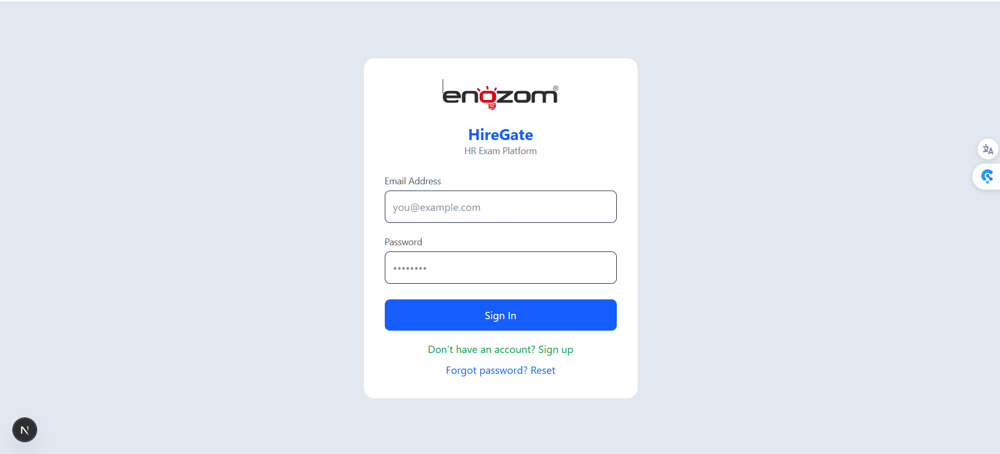
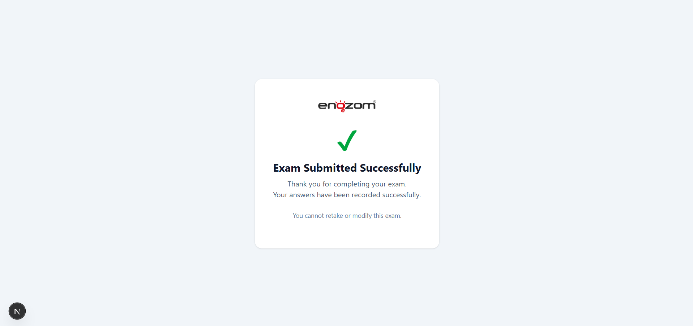

# HireGate

A modern recruitment platform for managing candidates, exams, questions, and evaluation workflows.

## Demo
- **Live demo video:** [HireGate Demo.mp4 - Google Drive](https://drive.google.com/file/d/1xy31gF129iYFJyo-irO9U-6rE8fI8XHU/view)

## Screenshot Gallery
A sample of the app views below. There are 34 screenshots stored in `./screenshots/`.






## Features
- Candidate registration, login, and profile management
- Exam creation, question bank management, and topic organization
- Submission grading, result tracking, and exam history
- Admin / HR manager endpoints and dashboard support
- Reusable frontend components for UI consistency and faster page development
- Layered architecture with clear separation of concerns
- Repository pattern for data access and maintainable persistence logic

## Architecture
- **Layered architecture**: `API` → `Service` → `Repository`
- **Repository pattern**: repository interfaces and implementations isolate data access from business logic
- **Reusable frontend components**: shared UI components in `frontend/app/_components` for buttons, cards, forms, tables, and modals

## Getting Started

### Prerequisites
- .NET SDK 8+ installed
- Node.js 18+ installed
- npm or yarn installed

### Backend
```powershell
cd backend/HireGate.API
dotnet restore
dotnet build
dotnet run
```

### Frontend
```powershell
cd frontend
npm install
npm run dev
```

## Project Structure
- `backend/HireGate.API` - ASP.NET Web API project
- `backend/HireGate.Repository` - data access layer using repository pattern
- `backend/HireGate.Service` - business logic, validation, and service coordination
- `frontend` - Next.js application with reusable frontend components

## How to Use
1. Start the backend API.
2. Start the frontend application.
3. Open the browser at `http://localhost:3000`.
4. Use the UI to create exams, questions, topics, and candidate submissions.

## Video Demo
- Demo URL: [HireGate Demo.mp4 - Google Drive](https://drive.google.com/file/d/1xy31gF129iYFJyo-irO9U-6rE8fI8XHU/view)

## Screenshots
All screenshots in the `screenshots/` directory are included in the project.

- **Login** - `./screenshots/Login.png`
- **Forgot Password** - `./screenshots/Forgot_Password.png`
- **Reset Password** - `./screenshots/Reset_Password.png`
- **Create Exam** - `./screenshots/Create%20Exam.png`
- **Exams Landing Page** - `./screenshots/1%20-%20Exams%20Landing%20Page.png`
- **View Exam Page** - `./screenshots/2%20-%20View%20Exam%20Page.png`
- **Start Exam Candidate** - `./screenshots/2-start_exam_candidate.png`
- **Exam Candidate** - `./screenshots/3-exam_candidate.png`
- **View Choices of Exam Questions** - `./screenshots/3%20-%20View%20choices%20of%20the%20Questions%20of%20the%20Exam.png`
- **Exam Modes** - `./screenshots/3%20Modes%20of%20exams.png`
- **Submission Success** - `./screenshots/4-submitted_succesfully.png`
- **Edit Exam Page** - `./screenshots/9%20-%20Edit%20Exam%20Page.png`
- **Edit Exam Question Part** - `./screenshots/10%20-%20Edit%20Exam%20Question%20Part.png`
- **Delete Exam Modal** - `./screenshots/11%20-%20Delete%20Exam%20Modal.png`
- **Paginated Pages View** - `./screenshots/12%20-%20Paginated%20Pages%20View.png`
- **Candidates Overview** - `./screenshots/1-candidates.png`
- **Candidates View 2** - `./screenshots/2-candidates2.png`
- **Question Bank 1** - `./screenshots/1-question_bank1.png`
- **Question Bank 2** - `./screenshots/2-question_bank2.png`
- **Add Question** - `./screenshots/add%20question%20.png`
- **Add Topic** - `./screenshots/add_topic.png`
- **Admin Complete Register** - `./screenshots/Admin_Complete_Register.png`
- **Delete Candidate** - `./screenshots/delete_candidate.png`
- **Delete Question** - `./screenshots/delete_question.png`
- **Edit Question 1** - `./screenshots/edit%20question%201.png`
- **Edit Question 2** - `./screenshots/edit%20question%202.png`
- **Exam Review Candidate for Admin Only** - `./screenshots/exam_review_candidate_for_admin_only.png`
- **Picking Questions for Hybrid Choice** - `./screenshots/picking%20questions%20for%20hybrod%20choice.png`
- **Send Bulk Email** - `./screenshots/send_bulk_email.png`
- **Send Single Email** - `./screenshots/send_single_email.png`
- **Topics and Random Question Generation** - `./screenshots/u%20can%20choose%20topics%20and%20number%20of%20questions%20and%20generated%20randomly.png`
- **View Candidate** - `./screenshots/view_candidate.png`
- **View Question** - `./screenshots/view_question.png`

## Running Tests
### Backend tests
```powershell
cd backend/HireGate.Api.Tests
dotnet test
```

### Repository / Service tests
```powershell
cd backend/HireGate.Repository.Tests
dotnet test

cd backend/HireGate.Service.Tests
dotnet test
```

## Contributing
Contributions are welcome. Please open issues or merge requests for fixes, improvements, and new features.

## License
Specify the project license here.

## Notes
Update the screenshot image paths and demo link before sharing the repository.
