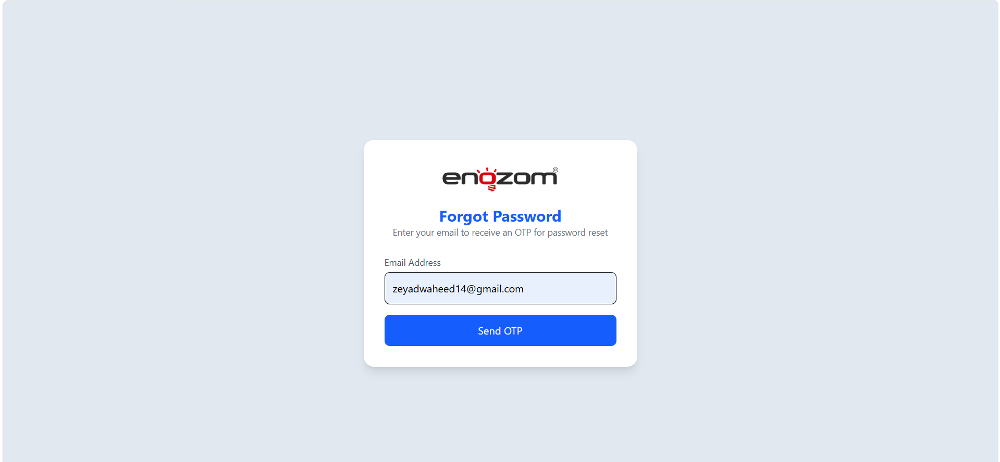
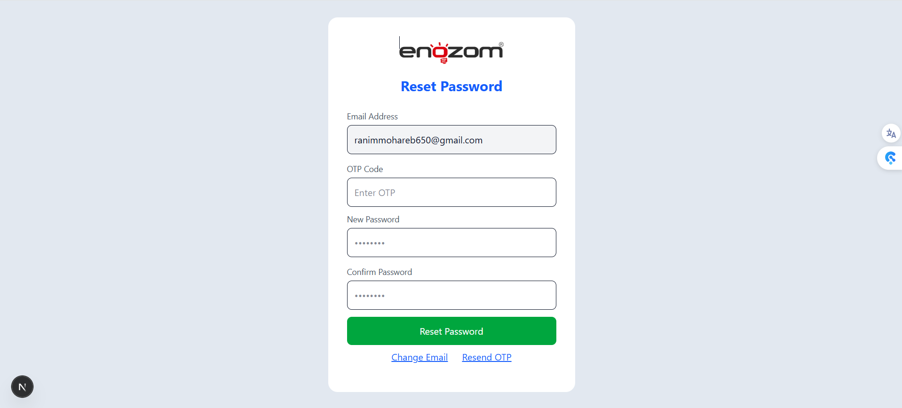
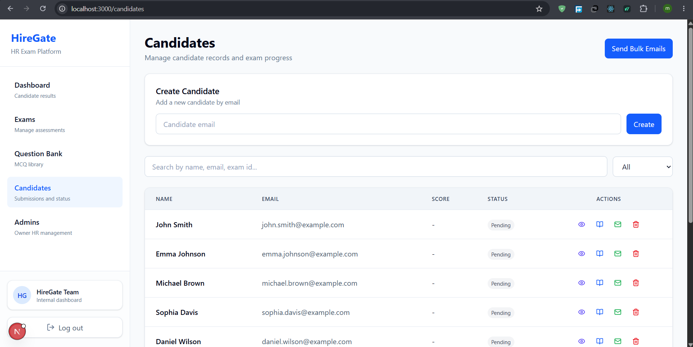
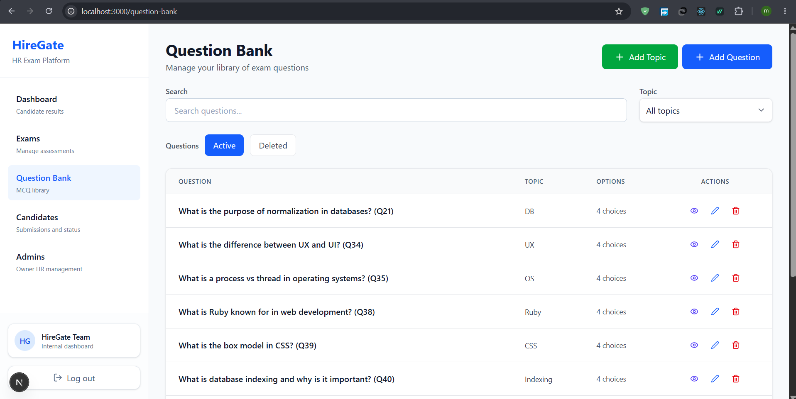

# HireGate

A modern recruitment platform for managing candidates, exams, questions, and evaluation workflows.

## Demo
- **Live demo video:** [HireGate Demo.mp4 - Google Drive](https://drive.google.com/file/d/1xy31gF129iYFJyo-irO9U-6rE8fI8XHU/view)

## Screenshot Gallery
A sample of the app views below. There are 34 screenshots stored in `./screenshots/`.









## Features
- Candidate registration, login, and profile management
- Exam creation, question bank management, and topic organization
- Submission grading, result tracking, and exam history
- Admin / HR manager endpoints and dashboard support
- Reusable frontend components for UI consistency and faster page development
- Layered architecture with clear separation of concerns
- Repository pattern for data access and maintainable persistence logic

## Architecture
- **Layered architecture**: `API` → `Service` → `Repository`
- **Repository pattern**: repository interfaces and implementations isolate data access from business logic
- **Reusable frontend components**: shared UI components in `frontend/app/_components` for buttons, cards, forms, tables, and modals

## Getting Started

### Prerequisites
- .NET SDK 8+ installed
- Node.js 18+ installed
- npm or yarn installed

### Backend
```powershell
cd backend/HireGate.API
dotnet restore
dotnet build
dotnet run
```

### Frontend
```powershell
cd frontend
npm install
npm run dev
```

## Project Structure
- `backend/HireGate.API` - ASP.NET Web API project
- `backend/HireGate.Repository` - data access layer using repository pattern
- `backend/HireGate.Service` - business logic, validation, and service coordination
- `frontend` - Next.js application with reusable frontend components

## How to Use
1. Start the backend API.
2. Start the frontend application.
3. Open the browser at `http://localhost:3000`.
4. Use the UI to create exams, questions, topics, and candidate submissions.

## Video Demo
- Demo URL: [HireGate Demo.mp4 - Google Drive](https://drive.google.com/file/d/1xy31gF129iYFJyo-irO9U-6rE8fI8XHU/view)

## Screenshots
A full screenshot collection is available in the `./screenshots/` folder.

> The gallery above shows a representative selection of the app views. If you want to inspect more, open the `screenshots/` directory in the repository.

## Running Tests
### Backend tests
```powershell
cd backend/HireGate.Api.Tests
dotnet test
```

### Repository / Service tests
```powershell
cd backend/HireGate.Repository.Tests
dotnet test

cd backend/HireGate.Service.Tests
dotnet test
```

## Contributing
Contributions are welcome. Please open issues or merge requests for fixes, improvements, and new features.

## License
Specify the project license here.

## Notes
Update the screenshot image paths and demo link before sharing the repository.
